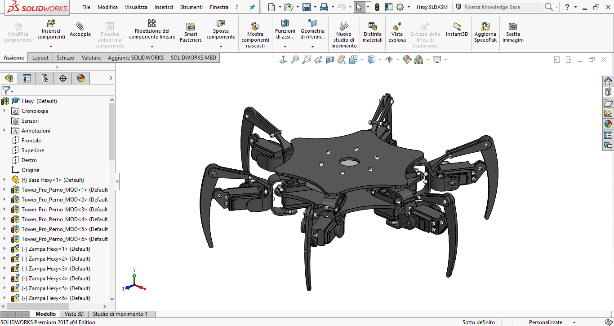
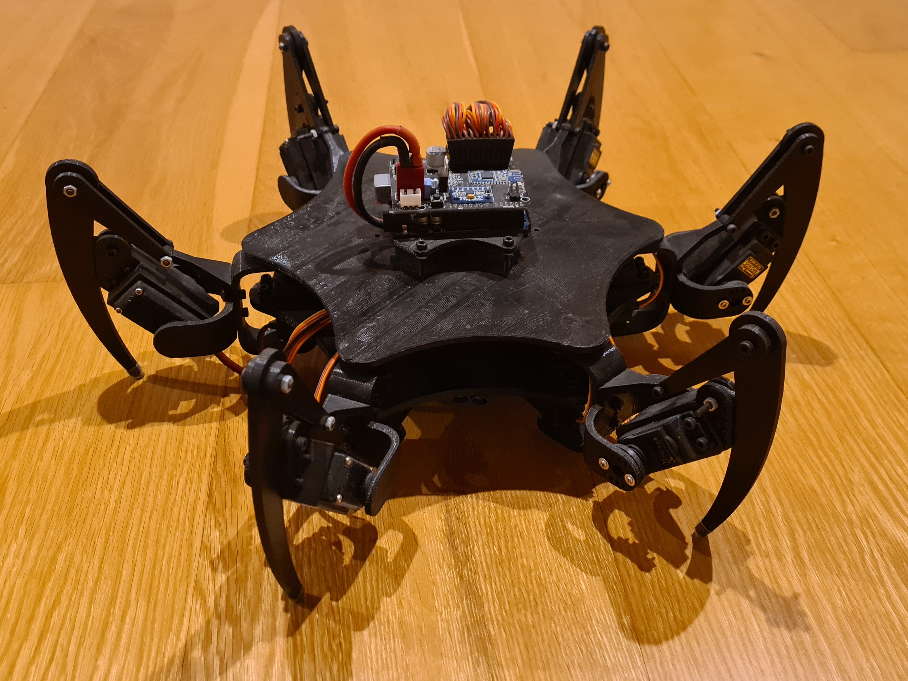
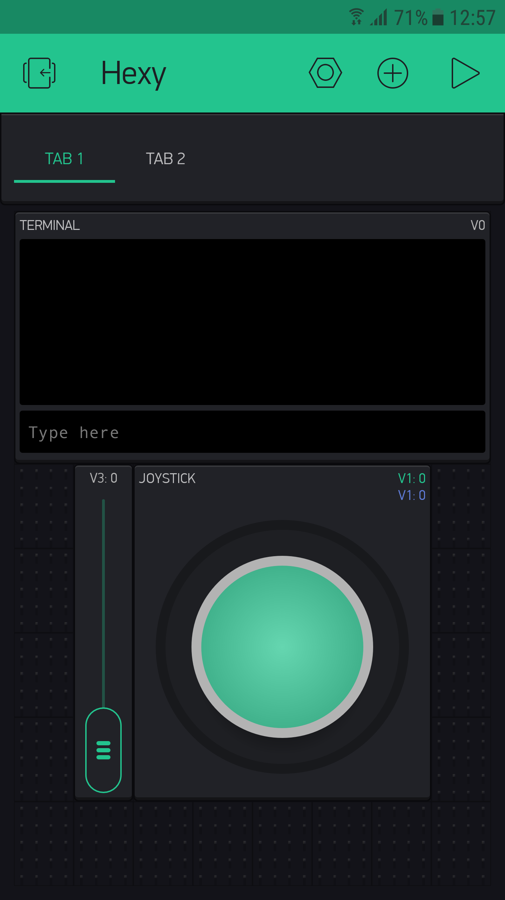
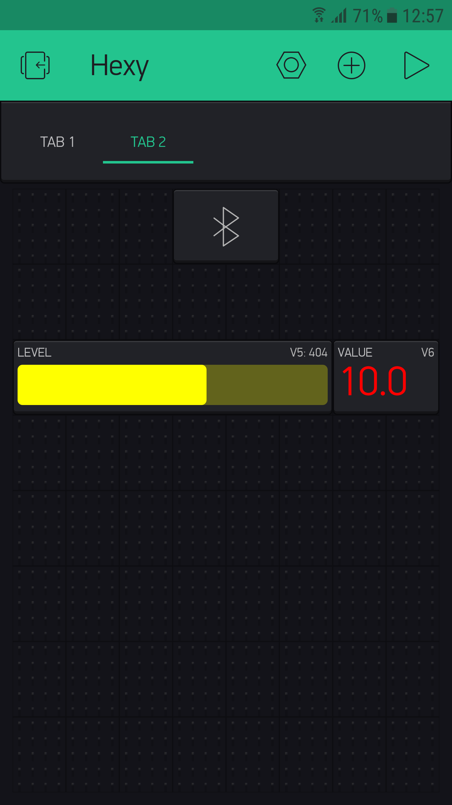
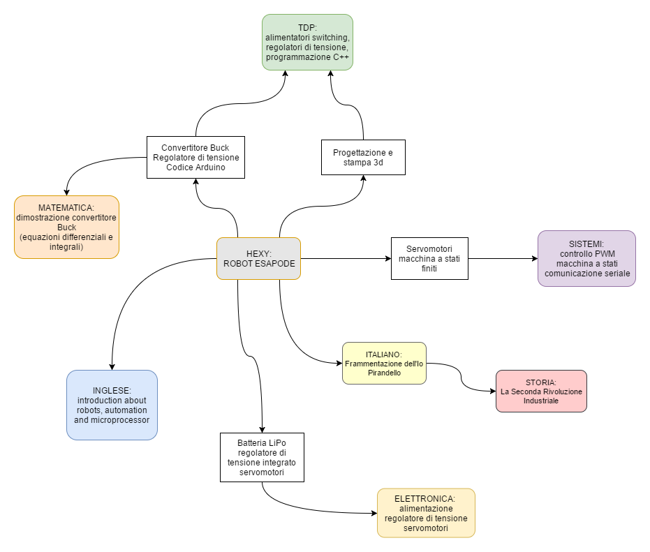

# Hexy - Robot esapode

  

### Progetto
Robot esapode a 2 gradi di libertà controllato da una scheda Arduino UNO, progetto per l'Esame di Stato per l'a.s. 2016/2017.

### Struttura della repository
- **src**: sorgenti del codice per Arduino.
- **stl**: file stl delle parti meccaniche.
- **docs**: documentazione e immagini per la repo.

---

     Hexy design    
     Struttura Hexy    
     Hexy completo    
        Applicazione per il controllo remoto    
   

---

### Descrizione
Nello sviluppo di questa tesina si è affrontata la progettazione e realizzazione di un robot a sei zampe controllato da una scheda Arduino UNO e dotato di 12 servomotori per il movimento, un modulo Bluetooth per il controllo remoto tramite applicazione per smartphone, un convertitore DC-DC step down per l’alimentazione di potenza, accelerometro e giroscopio.

Hexy è un robot esapode, composto appunto da sei zampe; ogni zampa è movimentata da due servomotori digitali controllati dal microcontrollore Arduino Uno. Questa configurazione prende il nome di zampa a due gradi di libertà.

Per la realizzazione del progetto sono state disegnate e stampate in 3D tutte le parti plastiche necessarie ed è stato realizzato uno shield per Arduino Uno in modo da ottimizzare e semplificare tutti i collegamenti elettrici.

---

  

